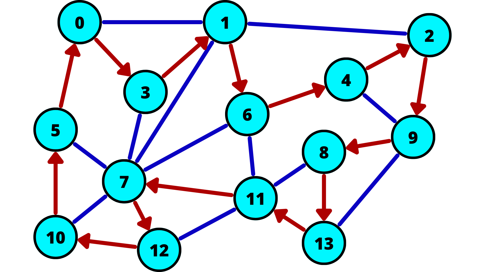
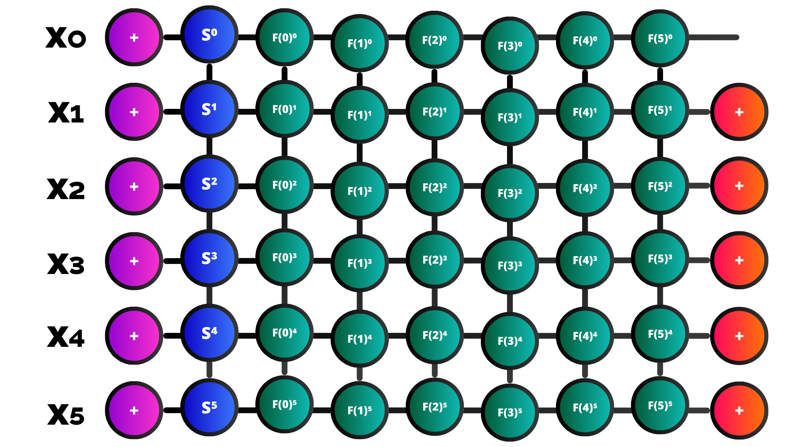

# 🧭 Tensor Network TSP Solver

Implementation of the quantum-inspired algorithm for solving the Traveling Salesman Problem (TSP) using tensor networks.



## 📖 Overview

This project implements a novel quantum-inspired algorithm for solving the Traveling Salesman Problem (TSP) using tensor networks. The approach leverages quantum computing concepts like superposition and imaginary time evolution to find optimal routes efficiently.

**Author:** Alejandro Mata Ali  
**Paper:** [Traveling Salesman Problem from a Tensor Networks Perspective](https://arxiv.org/abs/2311.14344)  
**Citation:** Alejandro Mata Ali, Iñigo Perez Delgado, Aitor Moreno Fdez. de Leceta. "Traveling Salesman Problem from a Tensor Networks Perspective" arXiv:2311.14344 [quant-ph] (2023)

## 🎯 The Traveling Salesman Problem

The TSP is one of the most famous optimization challenges in computer science. Given a set of cities and distances between them, the goal is to find the shortest possible route that visits each city exactly once and returns to the starting city.

**Mathematical Formulation:**
Minimize: 
$$C(\vec{x}) = \sum_{t=0}^{n-1} T_{x_t, x_{t+1}}$$
Where:
- `x_t` is the city visited at time step t
- `T[i,j]` is the distance between cities i and j  
- `x_n = x_0` (return to starting city)

**Constraints:**
- Each city must be visited exactly once
- The tour must form a complete cycle

## ⚛️ Tensor Network Algorithm



The algorithm implements a quantum-inspired approach consisting of four main steps:

### 1. 🔄 Quantum Superposition Initialization
Creates uniform superposition vectors representing all possible city combinations simultaneously using tensor networks.

```python
# Creates uniform superposition of all possible routes
uniform_node = tk.Node(tensor=torch.ones(n_nodes), name='uniform')
```

### 2. 🌀 Imaginary Time Evolution  
Applies evolution operators that exponentially favor shorter routes through imaginary time evolution with parameter τ (tau).

```python
# Evolution tensor favoring shorter distances
evolution_tensor = torch.exp(-tau * distances)
```

### 3. 🛡️ Constraint Enforcement
Uses restriction layers to ensure each city is visited exactly once. More layers provide stronger constraints but slower computation.

### 4. 🎯 Solution Extraction
Extracts the optimal route from the quantum state through projection and partial trace operations.

### Key Parameters:
- **τ (Tau)**: Controls optimization intensity. Higher values favor shorter routes but risk numerical overflow
- **Number of Restriction Layers**: Number of constraint layers. n-1 layers make the solver exact

## 🖥️ Streamlit Web Application

An interactive web interface that makes the quantum TSP solver accessible to everyone. Available in [https://tsp-with-tensor-networks.streamlit.app/](https://tsp-with-tensor-networks.streamlit.app/)

### ✨ Features

#### 📊 Problem Configuration
- **Manual Entry**: Interactive distance matrix editor
- **File Import**: Support for CSV and JSON formats with automatic size detection
- **Random Generation**: Create test problems with configurable parameters

#### 🎛️ Algorithm Controls
- **City Count**: Configure problem size (5-40 cities)
- **Parameter Tuning**: Adjust τ and restriction layers
- **Solver Options**: Customizable algorithm settings

#### 📈 Results Visualization
- **Performance Metrics**: Runtime and solution quality analysis
- **Interactive Graph**: Network visualization with optimal route highlighting
- **Step-by-Step Route**: Detailed path breakdown with distances
- **Solution Export**: Download results as JSON with complete metadata


## 🚀 Installation & Usage

### Prerequisites
```bash
Python 3.12 or higher
```

### Install Dependencies
```bash
pip install -r requirements.txt
```

### Launch the Application
```bash
streamlit run streamlit_app.py
```

The web application will open in your browser at `http://localhost:8501`

### Command Line Usage
```python
from tsp_module import tn_tsp_solver
import torch

# Define distance matrix
distances = torch.tensor([[0, 10, 15, 20],
                         [10, 0, 12, 18], 
                         [15, 12, 0, 14],
                         [20, 18, 14, 0]], dtype=torch.float32)

# Solve TSP
solution = tn_tsp_solver(distances, tau=1.0, n_layers=3)
print(f"Optimal route: {solution}")
```

## 📁 Project Structure

```
TSP/
├── 📄 streamlit_app.py          # Main Streamlit web application
├── 🧠 tsp_module.py             # Core tensor network TSP solver
├── 🔧 auxiliary_functions.py    # Helper functions for problem generation
├── 📥 import_functions.py       # File import/export functionality
├── 🖼️ TSP_Nodes.png            # TSP problem visualization
├── 🖼️ TensorNetworkTSP.png     # Algorithm structure diagram
├── 📊 tn_tsp_tests.ipynb        # Jupyter notebook with examples
├── 📋 requirements.txt          # Python dependencies
├── 📄 paper.pdf                 # Original research paper
├── 🧪 test_functions.py         # Unit tests
├── 🔍 auxiliary_solver.py       # Additional solver utilities
└── 📂 example_*.{csv,json}      # Sample input files
```

### Supported Input Formats

#### CSV Format
```csv
,City 0,City 1,City 2
City 0,0,10,15
City 1,10,0,20  
City 2,15,20,0
```

#### JSON Format (Simple)
```json
[[0,10,15],[10,0,20],[15,20,0]]
```

#### JSON Format (Structured)
```json
{
  "distance_matrix": [[0,10,15],[10,0,20],[15,20,0]],
  "problem_name": "Example TSP",
  "city_names": ["City A", "City B", "City C"]
}
```

## 📚 References & Citation

If you use this software in your research, please cite the original paper:

```bibtex
@article{mata2023traveling,
  title={Traveling Salesman Problem from a Tensor Networks Perspective},
  author={Mata Ali, Alejandro and Perez Delgado, I{\~n}igo and Moreno Fdez. de Leceta, Aitor},
  journal={arXiv preprint arXiv:2311.14344},
  year={2023}
}
```

**Paper URL:** https://arxiv.org/abs/2311.14344

## 📞 Contact & Support

**Author:** Alejandro Mata Ali  

For questions about the algorithm or implementation, please refer to the original paper or create an issue in this repository.

## 📄 License

Please refer to the original paper for licensing information regarding the algorithm. The Streamlit implementation follows standard open-source practices.

---


