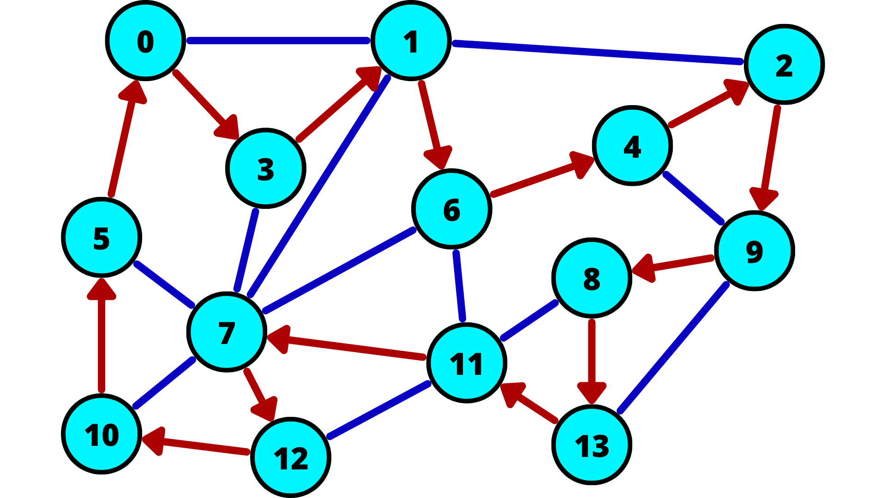
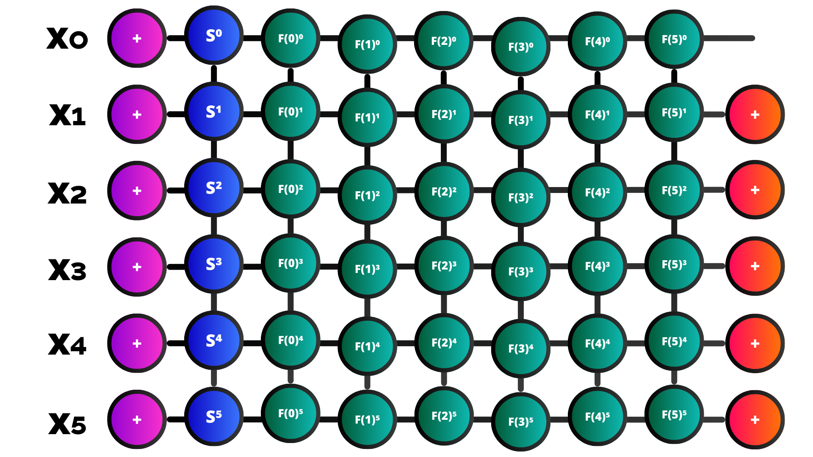

# Tensor Network TSP Solver

A quantum-inspired implementation for the Traveling Salesman Problem (TSP) using
tensor networks, with an interactive Streamlit web application and reproducible
benchmark scripts.



## Overview

This project implements an experimental tensor-network solver for the Traveling
Salesman Problem (TSP). The approach uses superposition-style tensors,
imaginary-time evolution weights, and restriction layers to extract candidate
routes from a tensor-network construction.

The repository also includes a benchmark suite that validates the implementation
on small synthetic TSP instances and compares it with classical baselines such
as Held-Karp, brute force, OR-Tools, and NetworkX heuristics.

Author: Alejandro Mata Ali

Paper: [Traveling Salesman Problem from a Tensor Networks Perspective](https://arxiv.org/abs/2311.14344)

Citation: Alejandro Mata Ali, Inigo Perez Delgado, Aitor Moreno Fdez. de Leceta.
"Traveling Salesman Problem from a Tensor Networks Perspective" arXiv:2311.14344
[quant-ph] (2023)

## The Traveling Salesman Problem

The TSP is one of the most famous optimization challenges in computer science.
Given a set of cities and distances between them, the goal is to find the
shortest possible route that visits each city exactly once and returns to the
starting city.

Mathematical formulation:

Minimize:

$$
C(\vec{x}) = \sum_{t=0}^{n-1} T_{x_t, x_{t+1}},
$$

where:

- $x_t$ is the city visited at time step $t$;
- $T_{i,j}$ is the distance between cities $i$ and $j$;
- $x_n = x_0$, so the route returns to the starting city.

Constraints:

- each city must be visited exactly once;
- the tour must form a complete cycle;
- forbidden edges, when present, must not be used.

## Tensor Network Algorithm



The implementation follows four main steps.

### 1. Quantum Superposition Initialization

Creates uniform tensors representing the initial search space of possible city
assignments.

```python
uniform_node = tk.Node(tensor=torch.ones(n_nodes), name="uniform")
```

### 2. Imaginary Time Evolution

Applies evolution weights that favor shorter edges through an imaginary-time
parameter $\tau$.

```python
evolution_tensor = torch.exp(-tau * distances)
```

Conceptually, the distance weights have the form:

$$
e^{-\tau T_{i,j}}.
$$

### 3. Constraint Enforcement

Uses restriction layers to encourage valid TSP tours, where each city appears
exactly once. More layers enforce more of the restriction structure, while fewer
layers define a reduced-layer heuristic.

### 4. Solution Extraction

Extracts a route from the tensor-network contraction through projection and
partial-trace operations.

### Key Parameters

- `tau` ($\tau$): controls the intensity of the imaginary-time weighting. It is
  numerically important and should be calibrated for experiments.
- `n_layers`: controls how many restriction layers are used. `n_layers=None`
  runs the full restriction-layer mode implemented by the solver.
- bond dimension: internal tensor-network dimension used by the implementation.

## Streamlit Web Application

An interactive web interface makes the TSP solver easier to explore.

### Features

#### Problem Configuration

- Manual entry: interactive distance matrix editor.
- File import: support for CSV and JSON inputs.
- Random generation: create test problems with configurable parameters.
- Problem validation: checks for matrix consistency and route feasibility.

#### Algorithm Controls

- City count: configure the number of cities.
- Parameter tuning: adjust `tau` and restriction layers.
- Solver options: run the tensor-network solver from the interface.

#### Results Visualization

- Runtime and route-cost reporting.
- Graph visualization with highlighted route.
- Step-by-step route breakdown.
- Result export with metadata.

#### User Guidance

- Parameter tips for small exploratory runs.
- Route validation feedback.
- Example workflows through the UI.

### Launch The Application

```bash
streamlit run streamlit_app.py
```

The web application opens at:

```text
http://localhost:8501
```

## Installation And Usage

### Prerequisites

```text
Python 3.11 or higher
```

Using a virtual environment is recommended.

Windows PowerShell:

```powershell
python -m venv .venv
.\.venv\Scripts\Activate.ps1
python -m pip install --upgrade pip
pip install -r requirements.txt
```

Linux/macOS:

```bash
python -m venv .venv
source .venv/bin/activate
python -m pip install --upgrade pip
pip install -r requirements.txt
```

### Install Benchmark Dependencies

```bash
pip install -r requirements-benchmark.txt
```

The `python-tsp` package is optional in the benchmark suite. If it is missing,
the corresponding wrappers are marked as `skipped_missing_dependency`.

### Command Line Usage

```python
import torch

from tsp_module import tn_tsp_solver

distances = torch.tensor(
    [
        [0.0, 10.0, 15.0, 20.0],
        [10.0, 0.0, 12.0, 18.0],
        [15.0, 12.0, 0.0, 14.0],
        [20.0, 18.0, 14.0, 0.0],
    ],
    dtype=torch.float32,
)

route = tn_tsp_solver(distances, tau=1.0, n_layers=None)
print(f"Route: {route}")
```

## Project Structure

```text
TSP/
|-- streamlit_app.py              # Main Streamlit web application
|-- tsp_module.py                 # Core tensor-network TSP solver
|-- auxiliary_functions.py        # Helper functions for problem generation
|-- auxiliary_solver.py           # Additional solver utilities
|-- import_functions.py           # File import/export functionality
|-- test_functions.py             # Original test/helper functions
|-- tn_tsp_tests.ipynb            # Jupyter notebook with examples
|-- benchmarks/                   # Reproducible benchmark scripts
|-- tests/                        # Pytest test suite
|-- results/                      # Selected benchmark CSV outputs
|-- reports/paper_figures/        # Paper-ready figures
|-- TSP_Nodes.png                 # TSP problem visualization
|-- TensorNetworkTSP.png          # Algorithm structure diagram
|-- requirements.txt              # Runtime dependencies
|-- requirements-benchmark.txt    # Benchmark and test dependencies
`-- README.md
```

## Technical Implementation

### Core Components

#### Tensor Network Construction

- Superposition layer: creates an initial uniform tensor representation.
- Evolution layer: applies distance-dependent imaginary-time weights.
- Restriction layer: enforces TSP constraints through projection operators.
- Contraction: extracts route information from the tensor network.

#### Optimization Features

- Template tensors: reuse common tensor structures where possible.
- Reduced-layer runs: allow experiments with fewer restriction layers.
- Reproducible seeds: benchmark scripts control Python, NumPy, and PyTorch
  seeds.
- Numerical metadata: benchmark CSVs record validity, finite-edge checks, gaps,
  runtime, memory, tau, and selected layer information.

#### Implementation Notes

- Tensor operations use PyTorch.
- The solver accepts the existing public API used by the Streamlit app.
- `n_layers=None` is the full restriction-layer mode.
- Integer `n_layers` values are reduced-layer heuristic configurations.

### Supported Input Formats

#### CSV Format

```csv
,City 0,City 1,City 2
City 0,0,10,15
City 1,10,0,20
City 2,15,20,0
```

#### JSON Format

```json
[[0, 10, 15], [10, 0, 20], [15, 20, 0]]
```

#### Structured JSON Format

```json
{
  "distance_matrix": [[0, 10, 15], [10, 0, 20], [15, 20, 0]],
  "problem_name": "Example TSP",
  "city_names": ["City A", "City B", "City C"]
}
```

## Algorithm Performance And Benchmarks

### Experimental Scope

The benchmark suite is designed to:

- validate the TN solver against exact baselines on small TSP instances;
- compare its behavior with classical reference solvers;
- study the effect of using fewer restriction layers;
- keep calibration and evaluation seeds disjoint;
- make CSVs and paper figures reproducible.

These benchmarks do not claim computational advantage over specialized
classical solvers.

### Tests

```bash
pytest -q
```

### Tau Calibration

```bash
python -m benchmarks.calibrate_tau \
    --out results/tau_calibration.csv \
    --schedule-out results/tau_schedule.csv \
    --seeds 0 1 2 3 4 \
    --evaluation-seeds 5 6 7 8 9 \
    --sizes 5 6 7 8 9 10 12
```

Tau calibration uses only calibration seeds. The default calibration is
two-stage:

1. test integer `tau` values from 1 to 20;
2. refine around the best first-stage value with step 0.2, using up to 10
   values below and 10 above.

The final schedule selects one tau per problem size `n`, shared by Euclidean,
random symmetric, and random asymmetric TSP instances.

### Small Exact Evaluation

```bash
python -m benchmarks.run_tsp_benchmarks \
    --suite small_exact \
    --out results/tsp_small_exact.csv \
    --seeds 5 6 7 8 9 \
    --tau-schedule results/tau_schedule.csv \
    --sizes 5 6 7 8 9 10
```

This experiment compares TN full-layer mode with exact baselines. Held-Karp is
used as the main exact reference, and brute force is used for small enough
instances.

### Classical Comparison

```bash
python -m benchmarks.run_tsp_benchmarks \
    --suite classical_comparison \
    --out results/classical_comparison.csv \
    --seeds 5 6 7 8 9 \
    --tau-schedule results/tau_schedule.csv \
    --sizes 5 6 7 8 9 10 12
```

This experiment includes TN full-layer mode, reduced-layer TN configurations,
Held-Karp, brute force where feasible, OR-Tools, NetworkX heuristics, and
optional `python-tsp` wrappers.

### Layer-Removal Experiment

```bash
python -m benchmarks.run_layer_ablation \
    --out results/layer_ablation.csv \
    --summary-out results/layer_ablation_summary.csv \
    --seeds 5 6 7 8 9 \
    --tau-schedule results/tau_schedule.csv \
    --sizes 8 10 12 \
    --instance-types euclidean random_symmetric random_asymmetric \
    --layer-ratios 0.0 0.1 0.25 0.5 0.75 1.0 \
    --repeats 5
```

Here `layer_ratio=1.0` corresponds to the real full-layer mode of the solver:
`n_layers=None`. Lower ratios use fewer restriction layers and are interpreted
as heuristic approximations. All repetitions are recorded in the output CSVs.

### Plots And Paper Figures

General plots:

```bash
python -m benchmarks.make_plots \
    --results-dir results \
    --out-dir reports/figures
```

Publication-style figures:

```bash
python -m benchmarks.paper_figures \
    --out-dir reports/paper_figures \
    --tau-schedule results/tau_schedule_paper_full.csv \
    --tau-calibration results/tau_calibration_paper_full.csv \
    --small-exact-tau1 results/tsp_small_exact_tau1_paper_full.csv \
    --small-exact-calibrated results/tsp_small_exact_paper_full.csv \
    --classical-comparison results/classical_comparison_paper_full.csv \
    --layer-ablation results/layer_ablation_paper_full.csv
```

Paper-ready figures are written as both PDF and PNG:

- `paper_tau_schedule`;
- `paper_tau_optimal_rate_by_n`;
- `paper_tau_calibration_quality`;
- `paper_solver_comparison`;
- `paper_layer_ablation`.

### Included Paper Results

The repository may include the following precomputed benchmark outputs:

```text
results/tau_calibration_paper_full.csv
results/tau_schedule_paper_full.csv
results/tsp_small_exact_tau1_paper_full.csv
results/tsp_small_exact_paper_full.csv
results/classical_comparison_paper_full.csv
results/layer_ablation_paper_full.csv
results/layer_ablation_summary_paper_full.csv
```

These are generated from disjoint calibration and evaluation splits. They are
provided so the paper figures can be regenerated.

## Configuration Options

### Algorithm Parameters

| Parameter | Description | Notes |
| --- | --- | --- |
| `tau` ($\tau$) | Imaginary-time weighting strength | Must be calibrated carefully |
| `n_layers` | Number of restriction layers | `None` means full-layer mode |
| bond dimension | Internal tensor-network dimension | Managed by the implementation |

### Benchmark Splits

| Split | Seeds | Purpose |
| --- | --- | --- |
| calibration | `0 1 2 3 4` | Select tau values |
| evaluation | `5 6 7 8 9` | Run benchmarks and ablations |

### Instance Families

| Instance type | Description |
| --- | --- |
| `euclidean` | Symmetric Euclidean TSP in 2D |
| `random_symmetric` | Random complete symmetric TSP |
| `random_asymmetric` | Random complete asymmetric TSP |
| `sparse_hamiltonian_symmetric` | Sparse TSP with guaranteed Hamiltonian cycle, used by ablation when requested |

## Troubleshooting

### Sequential Or Trivial-Looking Route

Possible cause: `tau` may be too large for the distance scale.

Suggested action: rescale the distance matrix or try a smaller/calibrated tau.

### Repeated Cities

Possible cause: insufficient restriction enforcement or numerical instability.

Suggested action: use `n_layers=None` for full-layer mode and check route
validity with the benchmark metrics.

### Infinite Or Forbidden Edges

Possible cause: the solver selected an edge marked as `inf`.

Suggested action: inspect the `finite_edges` and `status` columns in benchmark
outputs. These cases are intentionally recorded and should not be discarded.

### Numerical Underflow Or Overflow

Possible cause: the exponential weights $e^{-\tau T_{i,j}}$ are too extreme for
the selected scale.

Suggested action: normalize distances and calibrate tau on a held-out
calibration split.

### Slow Runs

Possible cause: tensor-network contraction cost grows quickly with the number of
cities and restriction layers.

Suggested action: start with small instances and use reduced-layer runs only as
heuristic experiments.

## References And Citation

If you use this software in your research, please cite the original paper:

```bibtex
@article{mata2023traveling,
  title={Traveling Salesman Problem from a Tensor Networks Perspective},
  author={Mata Ali, Alejandro and Perez Delgado, I{\~n}igo and Moreno Fdez. de Leceta, Aitor},
  journal={arXiv preprint arXiv:2311.14344},
  year={2023}
}
```

Paper URL: <https://arxiv.org/abs/2311.14344>

## Contact And Support

For questions about the algorithm or implementation, please refer to the paper
or open an issue in this repository.

## License

See the repository license file.
